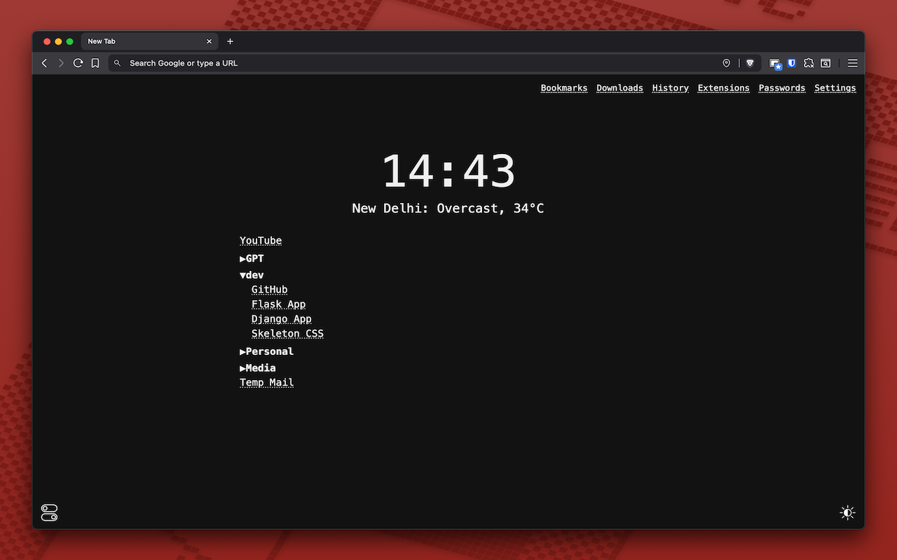
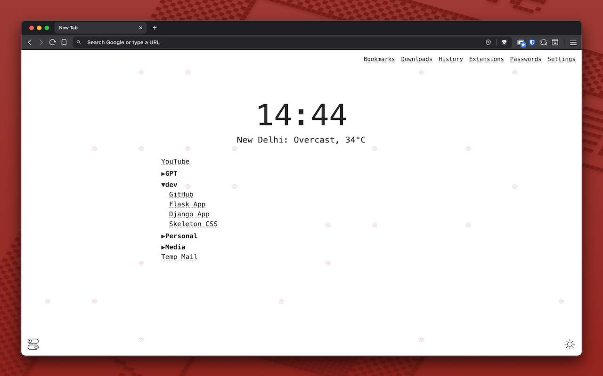
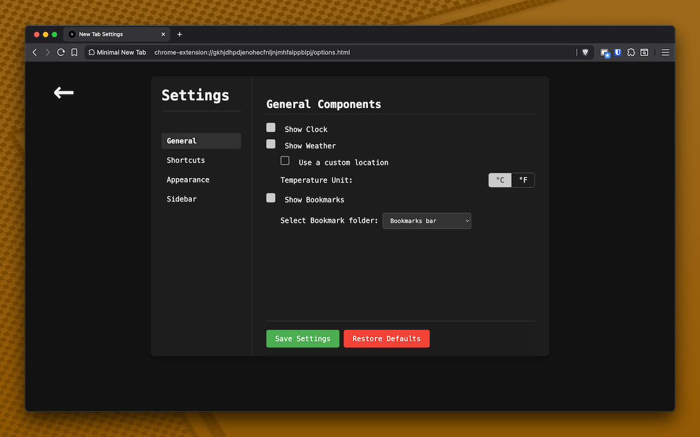
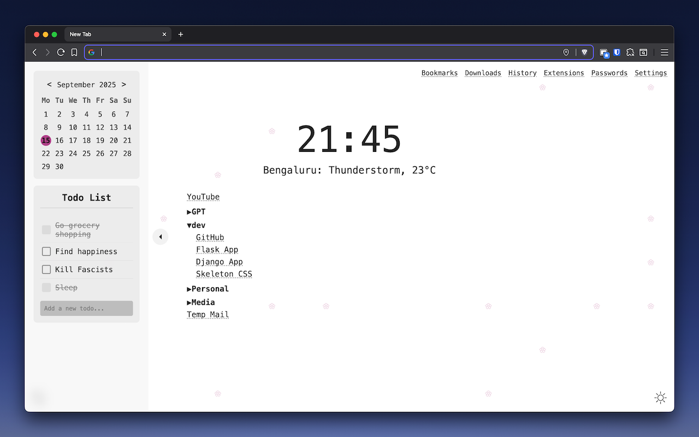

# Minimal New Tab

✨ A clean, minimal, customizable **New Tab page** for Chrome, with:
- 📅 Digital clock (hours + minutes)
- 🌤️ Weather of your current location
- 🔍 Search bar that focuses the address bar
- ⭐ Bookmarks (organized in folders, collapsible tree view)
- 🌓 Theme support: light, dark, and system preference toggle
- 🖤 Monospace, minimal aesthetic

---

## 🚀 Features

- Minimal, distraction-free design  
- Digital clock at center  
- Current weather for your geolocation (via [Open-Meteo](https://open-meteo.com/))
- Bookmarks with folder structure preserved, collapsible  
- Theme switcher: dark, light, system — remembers your choice  
- Fully client-side, no analytics or tracking

---

## 📷 Screenshots

|           Dark Theme              |         Light Theme                 |
|-----------------------------------|-------------------------------------|
|  |  |
| Options                           |         Sidebar                     |
||  |


---

## Installation

[](https://chromewebstore.google.com/detail/minimal-new-tab/hdodpjlgcieifmkkidligdnonbfiijnd)

For manual installation, clone this repository and [load it as an unpacked extension](https://developer.chrome.com/docs/extensions/get-started/tutorial/hello-world#load-unpacked).
```bash
git clone https://github.com/ujain1999/minimal_newtab.git
cd minimal_newtab
python build.py prod
```

Then load the `dist/prod` folder as an unpacked extension in Chrome.

---

## Development

### Setup

```bash
git clone https://github.com/ujain1999/minimal_newtab.git
cd minimal_newtab
uv sync  # Install dependencies with uv
```

**Requirements:** [uv](https://docs.astral.sh/uv/) (fast Python package manager)

### Building

The build script minifies and bundles files into the `dist` folder:

```bash
# Development mode with auto-watch
python build.py dev

# One-time development build
python build.py dev --once

# Production build
python build.py prod

# Production build + create distributable zip
python build.py prod --zip
```

For more details, see the top of `build.py`.