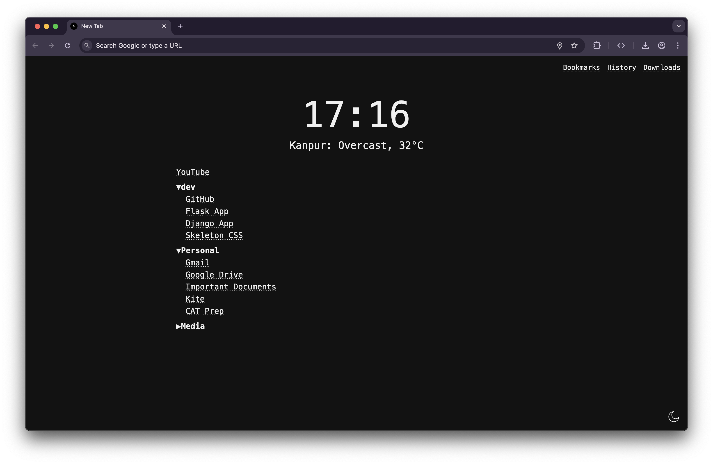
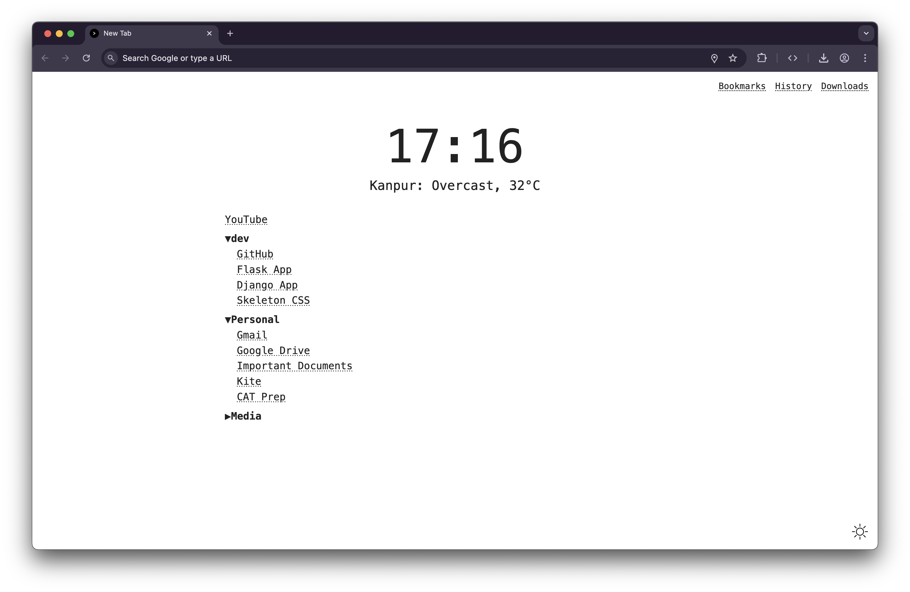

# Minimal New Tab

✨ A clean, minimal, customizable **New Tab page** for Chrome, with:
- 📅 Digital clock (hours + minutes)
- 🌤️ Weather of your current location
- 🔍 Search bar that focuses the address bar
- ⭐ Bookmarks (organized in folders, collapsible tree view)
- 🌓 Theme support: light, dark, and system preference toggle
- 🖤 Monospace, minimal aesthetic

---

## 🚀 Features

✅ Minimal, distraction-free design  
✅ Digital clock at center  
✅ Current weather for your geolocation (via [Open-Meteo](https://open-meteo.com/))
✅ Bookmarks with folder structure preserved, collapsible  
✅ Theme switcher: dark, light, system — remembers your choice  
✅ Fully client-side, no analytics or tracking

---

## 📷 Screenshots

| Dark Theme | Light Theme |
|------------|-------------|
|  |  |

---

## 🧑‍💻 Installation (Unpacked)

1️⃣ Clone this repository:
```bash
git clone https://github.com/YOUR_USERNAME/minimal-new-tab.git